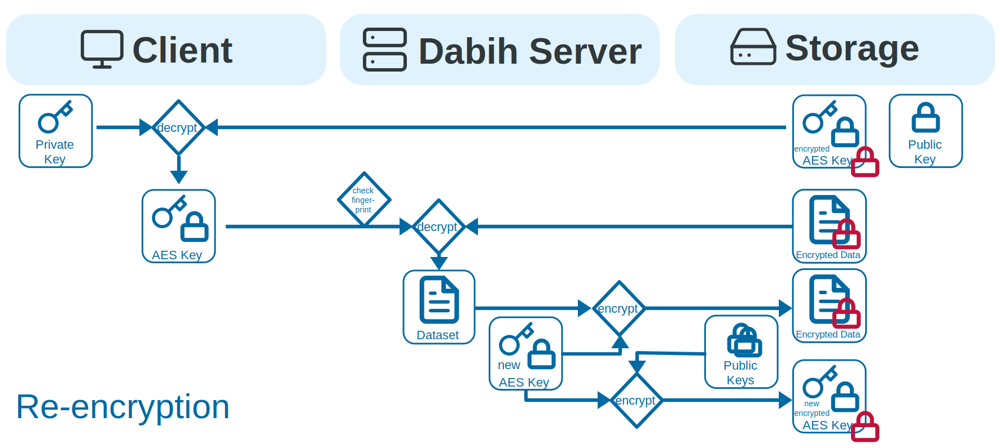

# Dabih data storage platform

- A secure way to upload and share data
- You decide who gets access to your data
- End-to-end encrypted, redundant data storage
- Simple to use

## Quickstart

Start a demo version of dabih:

```
    docker run -p 3000:3000 thespanglab/dabih:latest
```

## Installation

The simplest way to install dabih is to use the prebuilt containers on Docker
Hub

- [thespanglab/dabih](https://hub.docker.com/repository/docker/thespanglab/dabih/general)
- [thespanglab/dabih-client](https://hub.docker.com/repository/docker/thespanglab/dabih-client/general)
- [thespanglab/dabih-api](https://hub.docker.com/repository/docker/thespanglab/dabih-api/general)

### Docker Compose

The `example` folder contains a full example for docker-compose with caddy as a
reverse proxy

### Kubernetes

The `example/kubernetes` folder contains a full example for kubernetes with a
redis store and postgres database.

## How dabih works

First and foremost dabih provides an API for uploading , storing , sharing and
downloading arbirary data. The key difference for dabih is that we guarantee
that no one except the people defined by dabih have access to the data, not even
system administrators or people with pysical access to the hard-disks the data
is stored on.

### Symmetric Cryptograpy


When you upload data to dabih we generate a random key in memory and use
symmetric encrytion (AES-256-CBC) to encrypt data before it is stored. This only
changes the problem of safely storing data to safely storing the AES key of the
data. This is still useful since the key will only have 32 bytes.

### Asymmetric Cryptograpy

For the key storage we will encrypt the AES key again, but now using asymmetric
encryption. Asymmetric encryption is called asymmetric because there are 2
different keys:

- A public key, used to encrypt the data. The public key will be sent to Dabih
  and will be stored there. It is public information.
- A private key, used to decrypt the data. The private key should never be
  shared and only you should have it.


dabih allows you to easily generate such a keypair on your computer and then
send the public key to the server. You will only need to do this once, and for
security reasons every key needs to be confirmed by an admin first.


With this public key we can complete the upload and encrypt the AES key. The
encrypted key is stored and can only be decrypted using the private key that
dabih does not have.

### Download

If this dataset is downloaded a two-step decryption process is
required. First the encrypted AES key is downloaded and is decrypted using the
private key. This results in the unencrypted AES key. Then the encrypted dataset
is downloaded and decrypted using the newly aquired AES key.


Note: This guarantees that only the client with the private key can access the
dataset.

### Data Sharing

Of course we also need a way to safely share datasets with other users. Because
dabih itself cannot access the data only a user who already has access can share
the dataset with others. Data sharing is similar to downloading, but only the
AES key is downloaded. This key is then sent back to dabih and encrypted with
the public key of the new user.


dabih keeps a record of users who have access (or used to have access) to
dataset and has 2 different kinds of permissions.

- read permission allows the user to download the dataset.
- write permission additionally allows the user to edit and share the dataset
  with others.

We also keep a fingerprint of the AES key and check it, to prevent malicious
clients from secretly exchanging the AES key. Note: If users have access to the
dataset once there are external risks. There is now way to prevent others from
having/keeping a copy of the dataset on a laptop or other storage medium.

### Data Deletion

Generally users can also delete datasets from dabih . But by default deletion
does not remove the underlying files and keys, and the dataset can be recovered
by an admin. dabih admins can decide to destroy and dataset. Destroying a
dataset deletes all its data and is irrevokable.

### Reencryption


