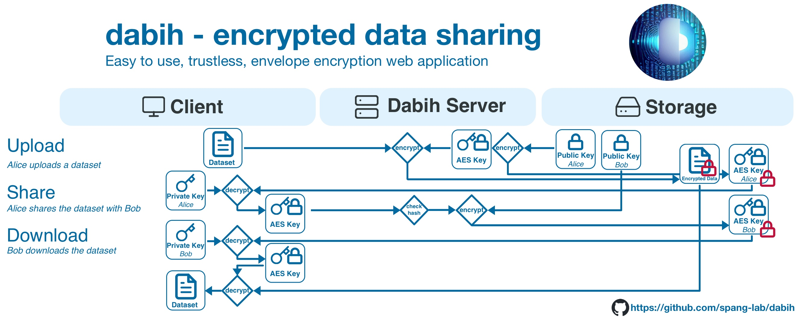

# Summary

dabih is a web application specifically designed to facilitate user-friendly encrypted
data management. dabih enables web-based uploading, storing, sharing, and downloading of sensitive data in any format.
We do not require users install software because our main client runs in the web browser.

dabih is a more secure alternative to popular self-hosted file storage platforms
like [Nextcloud](https://nextcloud.com) and [Seafile](https://www.seafile.com), while maintaining their
user-friendliness.

dabih's approach to data security involves a two-stage envelope encryption process.
We combine symmetric-key encryption for data and public-key encryption as key encapsulation mechanism.
The private key necessary for decrypting the data remains exclusively on the owner's device.
Thus, accessing data is impossible without explicit permission from the keyholder.
But all the cryptography occurs seamlessly in the background as users interact with a secure web portal,
simply by dragging and dropping files. In addition to their account users only
need to manage their private key. We made this as simple as possible, allowing
users to download their key as a file or by printing it as QR Code.

For advanced use cases, and for interoperability we provide a fully featured and documented JSON API and a command line interface (CLI)
tool. It implements all the major functions of the graphical dabih client, with some additional features
such as recursively searching the file system or compressing folders before upload.

# Statement of need

Modern biomedical research relies on large datasets, acquired by various techniques such as
sequencing analysis or imaging.
This encompasses the acquisition, storage, sharing and analysis of highly sensitive data, including human
genomic data. Handling such data carries significant ethical and legal implications, which are governed
by regulations like the General Data Protection Regulation (GDPR) in the European Union. Researchers
must maintain stringent security measures and uphold confidentiality to protect the integrity of sensitive
data.
For most sensitive clinical data, proper anonymization or pseudonymization are effective and practical
solutions to protect the individual's privacy. But genomic data is special because it is identifiable
by nature. In this case, the principle of least privilege [@polp] must be rigidly
applied. This can be achieved through the use of asymmetric encryption,
limiting access to a minimal set of authorized individuals. Additionally, implementing fine-grained access
control further ensures that only those authorized individuals can access the data.
Software and algorithms for this purpose are well established, with comprehensive recommendations available,
such as those from the German Federal Office for Information Security [@bsi-crypto]
The predominant shortcoming is the usability of these algorithms especially in integrating key management,
authentication, and authorization. For example, the most widely used standard OpenPGP [@rfc4880],
implemented by the GnuPG software, requires installing software, cryptography knowledge and is built for
use in the command line.
Typically, data owners are clinicians and biomedical researchers who
may not possess extensive IT expertise. It is crucial for them to manage their data securely while avoiding
the complexities involved in understanding encryption and key management in detail.
To address this, we created dabih, a web application specifically designed to facilitate
user-friendly encrypted data management. dabih relies on the Web Cryptography API [@web-crypto],
a tool integrated into modern web browsers, that allows us to run cryptographic algorithms locally in the users browser.
With this we overcome many usability and portability issues.

# Cryptography

dabih implements a hybrid cryptosystem with symmetric-key encryption for data and public-key encryption
as key encapsulation mechanism, enabling
easy permission changes by re-encrypting only the symmetric key to authorized data recipients. The
256-bit Advanced Encryption Standard with Cipher Block Chaining (AES-256-CBC),
as specified in NIST SP800-38A [@nistsp800-38a] is used as the symmetric
algorithm, 4096-bit RSA (Rivest–Shamir–Adleman) with Optimal Asymmetric
Encryption Padding (OAEP) as specified in RFC3447 [@rfc3447] is used for key
encryption.

We include multiple features to mitigate risks for users. Datasets can be re-encrypted in case of key loss as
long as there is at least one user with access to the dataset. Root keys, RSA key pairs that can decrypt all
datasets, may be configured as an emergency backup. The dabih CLI implements emergency recovery of dataset
directly from the file system storage.

# Data ingestion

As, by design, a private key is not required for uploading data, we use this as a feature for data ingestion.
A user generates a simple randomly generated upload token that can be sent to others and only enables them
to upload data to their account. We offer a separate graphical application, based on the dabih CLI.
This app is deliberately kept simple and only implements uploading.
It is pre-built for all major operating systems and available for download on our
[github releases page](https://github.com/spang-lab/dabih/releases/latest).

# Availablity

dabih is available on [GitHub](https://github.com/spang-lab/dabih).
We provide a container on [Docker Hub](https://hub.docker.com/r/thespanglab/dabih) for ease
of deployment. The dabih CLI is available on the GitHub releases page and on
[Crates.io](https://crates.io/crates/dabih).

# Acknowledgements

This work was funded by the Deutsche Forschungsgemeinschaft(DFG) as part of TRR 305, project Z01.

# References
